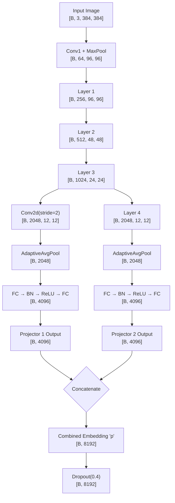
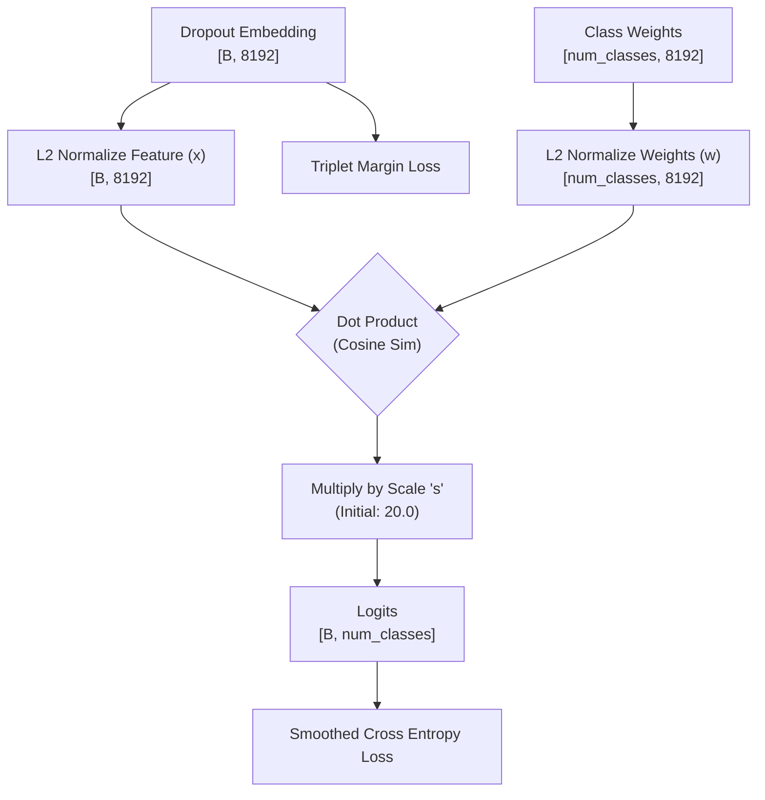
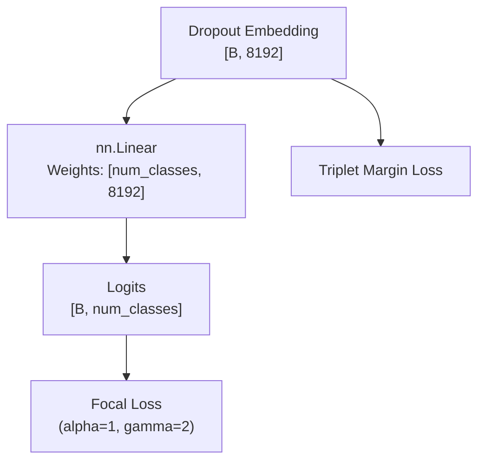
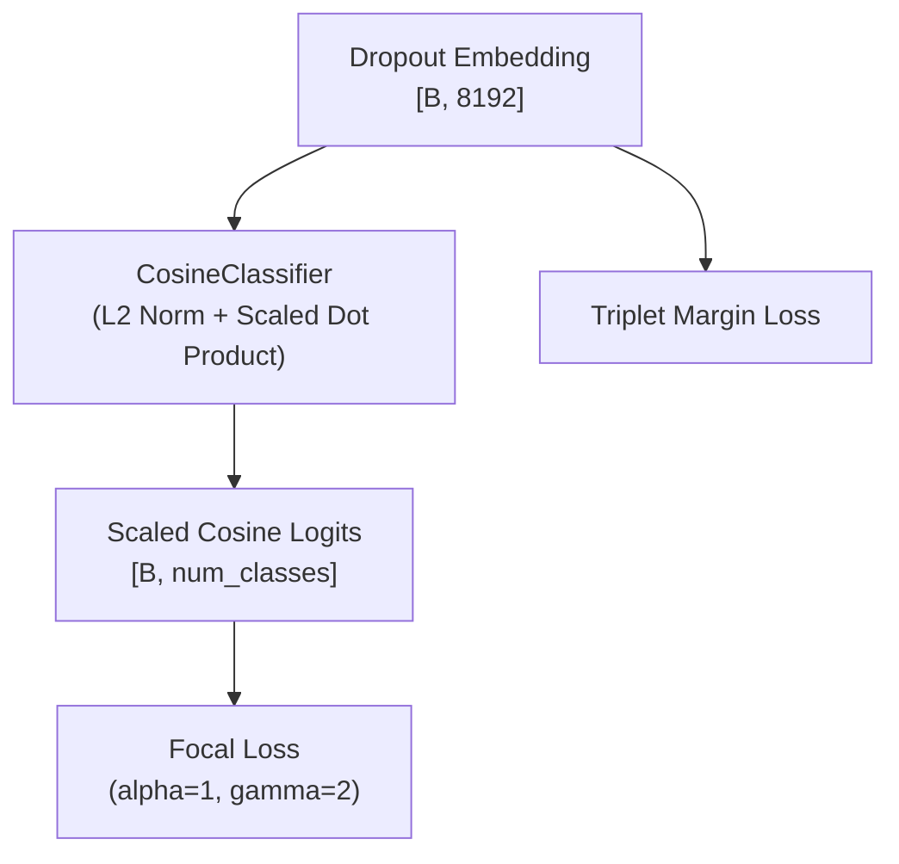
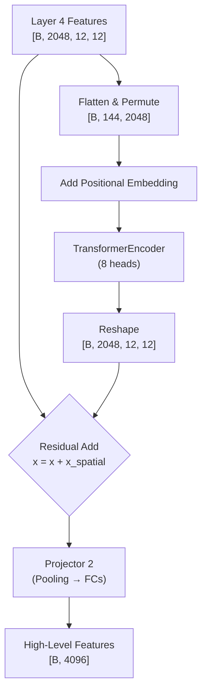
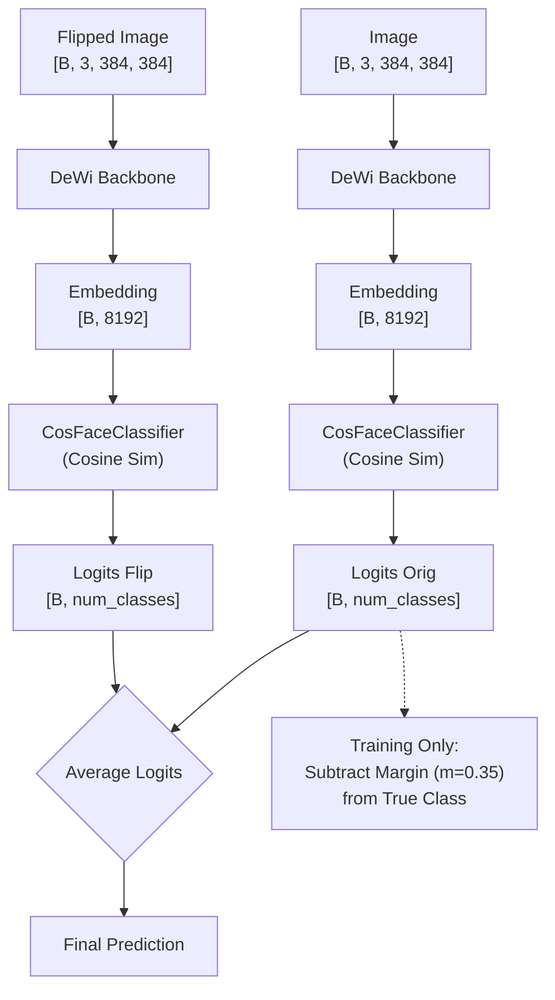

# Insect-Dewi: Model Architecture & Training History

This document provides a detailed, code-grounded description of all four training pipelines developed for the `dewi_resnet50` insect classification model. The dataset is a Vermont geo-located, insect-focused subset of the iNaturalist dataset. All pipelines share the same ResNet50 backbone and the same DeWi dual-projector architecture. What differentiates them is the classification head, loss function, optimizer, and training strategy.

Based on the work of Nguyen, Toan & Nguyễn, Huy & Ung, Huy & Ung, Hieu & Nguyen, Binh. (2024). Deep-Wide Learning Assistance for Insect Pest Classification. 10.48550/arXiv.2409.10445.

---

## Shared Foundation: The DeWi Architecture (`models/dewi.py`)

All four pipelines are built on top of the custom **DeWi** ("Deep-Wide") class. This is not a plain ResNet50. It is a heavily modified ResNet50 with a dual-stream projection network attached.

### 1. Convolutional Backbone (ResNet50)

The backbone is a standard ResNet50 with Bottleneck residual blocks arranged as `[3, 4, 6, 3]` blocks across four stages (Layer1–Layer4). The input is a 3-channel RGB image at **384×384 pixels**. The initial `conv1` applies a 7×7 convolution with stride 2, immediately followed by Batch Normalization and ReLU, and then a 3×3 MaxPool with stride 2. This reduces the spatial dimensions to 96×96 before passing through the four residual stages.

| Stage | Output Channels | Spatial Size (at 384px input) | Blocks |
|-------|----------------|-------------------------------|--------|
| conv1 + maxpool | 64 | 96×96 | — |
| Layer1 | 256 | 96×96 | 3 |
| Layer2 | 512 | 48×48 | 4 |
| Layer3 | 1024 | 24×24 | 6 |
| Layer4 | 2048 | 12×12 | 3 |

All convolutional weights are initialized with **Kaiming Normal** initialization. All BatchNorm layers are initialized with weight=1 and bias=0.

### 2. Dual-Stream Projector (The "Wide" Part)

After the backbone, instead of using the 2048-dimensional feature vector directly, the model branches into **two parallel projection heads** (`projector1` and `projector2`) that produce a much richer combined embedding. This is the distinguishing "Wide" feature of DeWi.

**Projector 1 (Mid-level features, `projector1`):**
- Taps into the output of `Layer3` (1024 channels, 24×24 spatial map).
- Applies a `Conv2d(1024 → 2048, kernel=2, stride=2)` to downsample and expand.
- Applies `AdaptiveAvgPool2d((1,1))` to collapse spatial dims to a 1D vector.
- Passes through two fully-connected layers with BatchNorm1d and ReLU: `Linear(2048→4096) → BN → ReLU → Linear(4096→4096)`.
- **Output:** A 4096-dimensional mid-level feature vector.

**Projector 2 (High-level features, `projector2`):**
- Taps into the output of `Layer4` (2048 channels) after `AdaptiveAvgPool2d((1,1))` and `Flatten`.
- Passes through two fully-connected layers: `Linear(2048→4096) → BN → ReLU → Linear(4096→4096)`.
- **Output:** A 4096-dimensional high-level feature vector.

**Combined Embedding:**
The two 4096-dim vectors are concatenated: `p = cat(p1, p2)` → **8192-dimensional** combined embedding. A `Dropout(p=0.4)` is applied to this combined vector before passing it to the final classification head.



### 3. Data Pipeline (`dataset_vt/pre_data_vt.py`)

Images are loaded from disk using `imageio` and preprocessed via the following transforms:

**Training:**
1. `Resize(input_size + 16)` — oversizes the image slightly for crop headroom.
2. `RandAugment(num_ops=2, magnitude=9)` — applies 2 randomly-chosen policy operations (e.g., shear, solarize, rotate) at magnitude 9 out of 30. Added in the most recent training iteration to improve generalization.
3. `RandomRotation(20)` — rotates ±20 degrees.
4. `RandomVerticalFlip()` — 50% chance of vertical flip.
5. `RandomCrop(input_size)` — crops to the final 384×384 size.
6. `ToTensor()` + `Normalize([0.485, 0.456, 0.406], [0.229, 0.224, 0.225])` — ImageNet normalization.

**Validation/Test:**
1. `Resize(input_size + 16)`.
2. `CenterCrop(input_size)` — deterministic crop, no augmentation.
3. `ToTensor()` + `Normalize`.

### 4. Checkpoint Management (`utils/auto_load_resume.py`)

Every pipeline uses a shared `auto_load_resume()` function that:
1. Checks if `current_model.pth` exists in the checkpoint directory.
2. Loads `model_state_dict` using `strict=False` (allows architectural changes between runs without crashing).
3. Strips the `module.` prefix from keys saved by `DataParallel`.
4. Restores the optimizer and scheduler states to resume the exact learning rate trajectory.
5. Reads `best_val_acc` from the separate `best_model.pth` to continue tracking improvement correctly.

### 5. Training Loop (`utils/focal_train_model.py`)

The shared training loop alternates between two mini-batch strategies on a per-batch basis using a `turn` flag:
- **Odd batches (turn=True):** Standard forward pass. Computes both the primary classification loss (`criterion`) and the auxiliary `TripletMarginLoss` using hard negative mining. Total loss = `ce_loss + metric_loss`.
- **Even batches (turn=False):** MixUp augmentation. Linearly interpolates two images and their labels with `alpha=1.0` (Beta distribution sampling). Only the classification loss is computed on the blended examples; the Triplet Loss is skipped since mixed labels are undefined for metric learning.

After each epoch, both `current_model.pth` (always overwritten) and `best_model.pth` (only when validation accuracy improves) are saved. All metrics are logged to Weights & Biases (`wandb`).

---

## Pipeline 1: Standard (`standard/train_vt.py`)

### Purpose
The original research baseline. This pipeline was designed specifically to solve a **Logit Norm Explosion** bug discovered in the earliest training runs, where the unconstrained linear classification head collapsed under the pressure of Triplet metric learning.

### Classification Head: `CosineClassifier`
The standard `nn.Linear` head was replaced with a custom class that constrains the geometry of the output space:

```python
# Forward pass of CosineClassifier
x = F.normalize(x, p=2, dim=1)      # L2-normalize the 8192-dim feature vector
w = F.normalize(self.weight, p=2, dim=1)  # L2-normalize each class weight vector
logits = F.linear(x, w) * self.scale     # Dot product == cosine similarity; multiply by scale s
```

Because both `x` and `w` are forced onto the unit hypersphere before the dot product, the maximum possible logit value is bounded by `s`. The scale `s` starts at 20.0 and is a `nn.Parameter`, so the network can learn to increase or decrease the sharpness of the softmax distribution over time. This mathematically prevents the logit explosion that destroyed the original run.



### Loss Functions
- **Primary:** `nn.CrossEntropyLoss(label_smoothing=0.1)`. Label smoothing replaces the hard target (probability 1.0 for the correct class, 0.0 for all others) with a soft distribution (0.9 for the correct class, `0.1 / (num_classes - 1)` for all others). This removes the mathematical asymptote that had been encouraging the linear head to drive logit magnitudes toward infinity.
- **Auxiliary:** `TripletMarginLoss(margin=0.2)` with `BatchHardMiner`.

### Optimizer & Scheduler
- **Optimizer:** SGD with `momentum=0.9`, `weight_decay=1e-4`.
- **Differential LR:** The backbone trains at `init_lr * 0.1` and the classification head trains at `init_lr` to protect pre-trained features.
- **Scheduler:** `MultiStepLR` with milestones at `[15, 30, 45, 60]` and decay `gamma=0.1`.

### Training History
- **Bug:** Original run with `nn.Linear` saw Cross Entropy loss explode to 300+ at epoch ~18, while Triplet Loss remained stable.
- **Fix:** Switching to `CosineClassifier` + label smoothing stabilized CE loss permanently at ~5.1.
- **Status:** Used as the foundation for all subsequent pipelines. Currently paused.

---

## Pipeline 2: Linear + Focal (`linear/linear_train_vt.py`)

### Purpose
A deliberate simplification of the Standard pipeline. The `CosineClassifier` is removed and replaced with a plain `nn.Linear` head, but the Cross Entropy loss is replaced with **Focal Loss** to handle class imbalance more aggressively.

### Classification Head: `nn.Linear`
```python
model.fc = nn.Linear(in_features, num_classes)
nn.init.kaiming_normal_(model.fc.weight, mode='fan_out', nonlinearity='relu')
nn.init.constant_(model.fc.bias, 0)
```
The head maps the 8192-dimensional combined DeWi embedding to `num_classes` logits using unconstrained dot products. The weights are Kaiming-initialized.



### Loss Functions

**Focal Loss (Primary):**
```python
ce_loss = F.cross_entropy(inputs, targets, reduction='none')  # Per-sample CE
pt = torch.exp(-ce_loss)                                      # p_t = probability of correct class
focal_loss = alpha * (1 - pt)**gamma * ce_loss                # Down-weight easy examples
```
With `gamma=2` and `alpha=1`, examples that are classified with high confidence (`pt → 1`) are down-weighted toward zero loss. Examples that are misclassified (`pt → 0`) retain near-full loss weight. This causes the gradient signal to focus exclusively on the difficult or rare insect classes.

**Auxiliary:** `TripletMarginLoss(margin=0.2)` with `BatchHardMiner`.

### Optimizer & Scheduler
- **Optimizer:** SGD with `momentum=0.9`, `weight_decay=5e-5`.
- **Differential LR:** Backbone at `init_lr * backbone_lr_factor (0.1)`, head at `init_lr (0.003)`.
- **Original Scheduler:** `MultiStepLR` at milestones `[40, 60, 80, 110, 130, 145]`, `gamma=0.2`.
- **Current Scheduler (post-plateau):** `CosineAnnealingWarmRestarts(T_0=20, T_mult=2)`. The LR follows a cosine decay from max to near-zero, then resets back to max after 20 epochs. After each restart, the cycle doubles (20 → 40 → 80 epochs), allowing longer convergence runs over time.

### Training History & Plateau
- **Reached:** Epoch 70+.
- **Plateau:** ~84.0% Validation Accuracy, ~77.6% Test Accuracy.
- **Root Cause:** The `MultiStepLR` had decayed the learning rate to `0.003 * 0.2^5 ≈ 9.6e-6` for the backbone, making weight updates far too small to escape the local minimum.
- **Fix Applied:** Swapped to `CosineAnnealingWarmRestarts` and added `RandAugment` to the data pipeline.

---

## Pipeline 3: Focal + Cosine (`focal/focal_train_vt.py`)

### Purpose
The most sophisticated of the active pipelines. Combines the class-imbalance handling of Focal Loss with the geometric stability of the `CosineClassifier` hypersphere head.

### Classification Head: `CosineClassifier`
Same architecture as in the Standard pipeline: L2-normalized features, L2-normalized weight vectors, and a learnable scale parameter `s`. The key difference is that this head is combined with Focal Loss instead of label-smoothed CE.



### Loss Functions

**Focal Loss (Primary):** Identical implementation to the Linear pipeline (`gamma=2`, `alpha=1`). Applied to the cosine similarity logits scaled by `s`.

**Auxiliary:** `TripletMarginLoss(margin=0.2)` with `BatchHardMiner`. The Triplet Loss operates directly on the raw 8192-dimensional `p` embedding (before the CosineClassifier head), optimizing the metric geometry of the full DeWi embedding space.

### Optimizer & Scheduler
- **Optimizer:** SGD with `momentum=0.9`, `weight_decay=5e-5`.
- **Differential LR:** Three parameter groups: backbone at `init_lr * backbone_lr_factor`, neck (if present) at `init_lr * neck_lr_factor`, head at `init_lr (0.003)`.
- **Original Scheduler:** `MultiStepLR` at milestones `[50, 70, 90, 115, 135, 148]`, `gamma=0.2`.
- **Current Scheduler (post-plateau):** `CosineAnnealingWarmRestarts(T_0=20, T_mult=2)`.

### Training History & Plateau
- **Reached:** Epoch 112.
- **Plateau:** ~84.1% Validation Accuracy, ~77.1% Test Accuracy. Validation loss settled at ~0.45, slightly below the Linear pipeline's ~0.53, confirming the CosineClassifier provides marginally more stable embeddings.
- **Root Cause:** Identical to the Linear pipeline — `MultiStepLR` had decayed the LR to near-zero.
- **Fix Applied:** Swapped to `CosineAnnealingWarmRestarts` and inherited the `RandAugment` augmentation from the shared data pipeline.

---

## Pipeline 4: Focal + Transformer (`foc_tran/foc_tran_train_vt.py`)

### Purpose
An experimental pipeline that inserts a self-attention module between the convolutional backbone and the classification head to enable the model to capture global long-range dependencies across the feature map.

### Model Architecture (`models/transform_dewi.py`)

This pipeline uses a separate model definition that adds a **`TransformerNeck`** to the DeWi architecture:

```python
class TransformerNeck(nn.Module):
    def __init__(self, d_model):
        self.transformer = nn.TransformerEncoderLayer(d_model=d_model, nhead=8, batch_first=True)
        self.pos_embed = nn.Parameter(torch.zeros(1, d_model, 1, 1))  # Learnable positional embedding
```

The neck is attached to the model *after* the pre-trained ImageNet weights are loaded, so it starts randomly initialized while the backbone starts from ImageNet features.

### Forward Pass with Transformer Neck

After `Layer4` produces a `[B, 2048, 12, 12]` spatial feature map, the Transformer Neck processes it as follows:

1. **Flatten to sequence:** `x.flatten(2).permute(0, 2, 1)` → reshapes `[B, 2048, 12, 12]` to `[B, 144, 2048]` (144 spatial tokens, each a 2048-dim vector).
2. **Add positional embedding:** A learnable `pos_embed` tensor is bilinearly interpolated to match the current spatial resolution and added to each token.
3. **Self-attention:** `nn.TransformerEncoderLayer(d_model=2048, nhead=8)` applies 8-head multi-head self-attention. Each of the 144 spatial tokens can attend to every other token, allowing the model to relate the texture of one body part to the shape of another.
4. **Spatial residual:** The transformer output is reshaped back to `[B, 2048, 12, 12]` and **added** to the original feature map (`x = x + x_spatial`) as a residual connection. This prevents the transformer from catastrophically overwriting the backbone features.
5. **Pooling and projection:** The output continues through `avgpool → flatten → projector2`, producing the 4096-dim high-level features that combine with the mid-level features from `projector1`.



### Loss Functions
Same as the Focal pipeline: `FocalLoss(alpha=1, gamma=2)` + `TripletMarginLoss(margin=0.2)` with `BatchHardMiner`. CosineClassifier head.

### Optimizer & Scheduler
- **Optimizer:** `AdamW` with three differential learning rate groups:
    - Backbone: `lr=1e-5`, `weight_decay=5e-5` (very low — heavily pre-trained)
    - Neck: `lr=3e-4`, `weight_decay=1e-2` (high — randomly initialized; high weight decay to prevent overfitting)
    - Head: `lr=3e-4`, `weight_decay=5e-5` (high — also randomly initialized)
- **Scheduler:** `CosineAnnealingLR(T_max=end_epoch, eta_min=1e-7)`. A single monotonically decreasing cosine curve over the full training run, without warm restarts.

### Training History & Plateau
- **Reached:** Epoch 117.
- **Plateau:** ~51.9% Validation Accuracy, ~46.1% Test Accuracy.
- **Root Cause:** The randomly initialized Transformer Neck received a 30× higher learning rate than the backbone. Without a **linear warmup phase**, the neck made enormous gradient updates in the first few epochs. These large gradients flowed backward directly into the pre-trained backbone via the residual connection, corrupting the ImageNet feature representations before the neck could learn anything coherent.
- **Status: Discontinued.** Stabilizing this pipeline would require either (a) a linear LR warmup for the neck, (b) completely freezing the backbone for the first N epochs, or (c) initializing the neck from a partially-trained checkpoint instead of random weights. None of these were pursued, as the pipeline significantly increases parameter count and memory overhead without demonstrating immediate gains over the simpler approaches.

---

## Pipeline 5: CosFace + TTA (`cosface_tta/cosface_tta_train_vt.py`)

### Purpose
The ultimate culmination of the project's optimization efforts, designed to break the ~87% accuracy ceiling established by the `Focal + Cosine` pipeline. It introduces a strict angular margin to forcefully separate class embeddings, and implements multi-view inference to squeeze out "free" accuracy gains without modifying the backbone.

### Classification Head: `CosFaceClassifier` (Angular Margin)
The `CosineClassifier` was completely refactored into a `CosFaceClassifier` that mathematically enforces a minimum angular margin between the true class and all negative classes.

```python
cosine = F.linear(F.normalize(x, p=2, dim=1), F.normalize(self.weight, p=2, dim=1))
# If training, subtract margin m from the ground-truth logit
phi = cosine - self.m 
one_hot = torch.zeros_like(cosine).scatter_(1, labels.view(-1, 1).long(), 1)
logits = (one_hot * phi) + ((1.0 - one_hot) * cosine)
logits = logits * self.s
```
- **Scale (`s=30.0`):** Fixed empirically rather than learned. Controls the radius of the hypersphere.
- **Margin (`m=0.35`):** The ground-truth cosine similarity is artificially reduced by `0.35` during training. This forces the model to not just classify the image correctly, but to push the embedding deep into its correct sector on the hypersphere, maximizing inter-class variance.

### Test-Time Augmentation (TTA) (`cosface_tta_eval.py`)
To maximize the predictive power of the model, the standard single-image evaluation loop was rewritten. During validation and testing, every image is evaluated twice:
1. The original `384x384` CenterCrop.
2. A horizontally flipped version (`torch.flip(images, dims=[3])`).

The model produces embeddings for both views. The embeddings (and resulting logits) are averaged before the final `argmax` prediction is made:
```python
p_orig, emb_orig = model(images)
p_flip, emb_flip = model(torch.flip(images, dims=[3]))
logits = (classifier(emb_orig) + classifier(emb_flip)) / 2.0
```
This multi-crop consensus makes the model significantly more robust to pose variations and morphological asymmetries.



### Optimizer, Scheduler & Resume Logic
- **Resume Strategy:** Instead of starting from scratch, this pipeline actively loads the 87% accurate `focal_best_model.pth`. The generic `model.fc` weights are intelligently mapped into the standalone `CosFaceClassifier`.
- **Optimizer:** SGD (`momentum=0.9`, `weight_decay=1e-4`). The backbone uses differential learning rates (`init_lr * 0.1`) while the new CosFace head trains at full `init_lr` to adjust to the new margin constraint.
- **Scheduler:** `CosineAnnealingWarmRestarts(T_0=20, T_mult=2)`.

### Training History & Current Status
- **Status: Active.** Currently running on `r6node01` as SLURM Job `4091086`.
- **Performance Expectation:** Initially, the CE loss will spike slightly as the model adjusts to the strict `m=0.35` penalty. Once the embeddings migrate to their tighter clusters, the combination of CosFace and TTA is expected to push accuracy past the 90-95% threshold.
